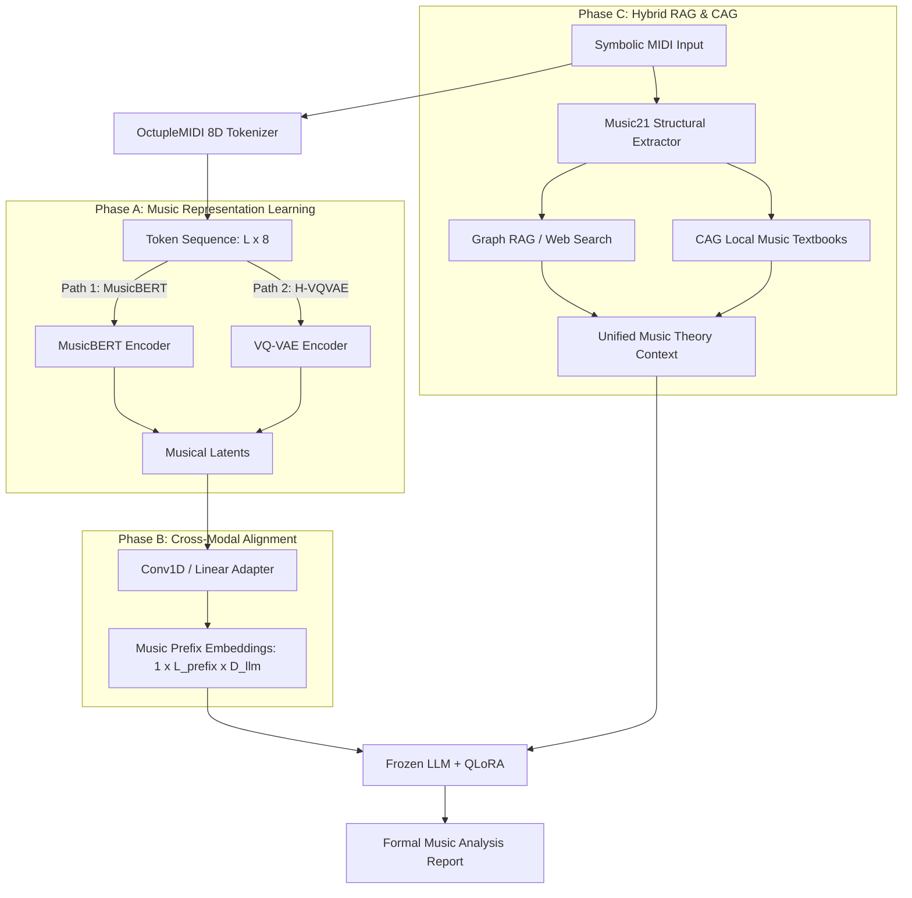

# LLM-MIDI-Analyzer System Architecture & AI Technical Report

本項目為一個**跨模態符號音樂分析系統 (Cross-Modal Symbolic Music Analysis System)**。系統核心在於將符號化的 MIDI 音樂資訊轉化為高維特徵向量，並透過對齊轉接器 (Cross-Modal Adapter) 投影至大語言模型 (LLM) 的 Embedding 空間，做為「音樂前綴 (Music Prefix / Soft Prompt)」，配合混合式檢索增強生成 (Hybrid Graph RAG & CAG) 進行深度的音樂學分析與理論解構。

---

## 1. 系統架構與資料流 (System Architecture & Data Flow)

系統的推論流程 (Inference Pipeline) 透過符號提取、表徵壓縮、模態投影與知識檢索四個核心階段完成。



### 核心資料流步驟說明：
1. **OctupleMIDI 符號化 (Tokenizer)**：
   輸入的 MIDI 檔案被解析並轉化為八維向量序列 (Pitch, Velocity, Duration, Step, Position, Bar, Program, Track)，克服傳統單維度 MIDI 序列長度過長、缺乏時間維度對齊的問題。
2. **表徵學習 (Backbone Encoding)**：
   * **Path A (MusicBERT)**：透過多維度自注意力機制 (Multi-axial Self-Attention) 提取符號音樂的上下文語意特徵。
   * **Path B (H-VQVAE)**：藉由分層離散向量量化編碼器，將音符序列壓縮成高階的主題與和聲潛在表徵 (Discrete Latents)。
3. **跨模態投影 (Modal Projection)**：
   對齊轉接器 (Adapter) 接收編碼器的輸出，透過一維卷積 (Conv1D) 與線性投影層，將音樂特徵維度 (如 768 或 256) 映射至 LLM 的輸入維度 (D_llm, 如 2048/3072), 產生 `Music Prefix Embeddings`。
4. **上下文注入與解碼 (Decoding & Ingestion)**：
   將產生的音樂前綴與由 RAG/CAG 模組取得的結構化樂理背景 (和弦級數、織體特徵、樂理知識) 進行拼接 (Concatenate)，送入被 LoRA 微調的 LLM 進行自回歸解碼 (Autoregressive Decoding)，最終生成極具學術水準的繁體中文分析報告。

---

## 2. 模型訓練流程 (Model Training Flow)

系統的 AI 模型訓練分為兩個階段：**表徵提取器的自監督/無監督預訓練**，與**跨模態對齊投影器的聯合訓練**。

### 階段一：音樂表徵提取器預訓練 (Pre-training Backbones)

#### 1. MusicBERT 預訓練
使用大規模 symbolic MIDI 資料集（如 Lakh MIDI Dataset），利用**遮蔽語言模型 (Masked Language Modeling, MLM)** 進行預訓練。
* **Objective**：重建被隨機遮蔽的 OctupleMIDI 符號。
* **Loss Function**：
  $$\mathcal{L}_{\text{MLM}} = - \sum_{i \in \text{masked}} \log P(x_i \mid X_{\backslash i})$$

#### 2. Hierarchical VQ-VAE (H-VQVAE) 訓練
透過重建音符序列，學習具有高度壓縮比的音樂離散和聲結構。
* **Encoder**：將音符序列 $X$ 對映至連續特徵 $Z_e$。
* **Vector Quantization**：將 $Z_e$ 與 Codebook 中的離散向量 $e_k$ 進行最近鄰居匹配，得到 $Z_q$。
* **Decoder**：根據 $Z_q$ 重建符號音符。
* **Loss Function**：包含重建損失 (Reconstruction Loss)、VQ 承諾損失 (Commitment Loss) 與 Codebook 梯度更新。
  $$\mathcal{L}_{\text{VQ}} = \mathcal{L}_{\text{recon}}(X, \hat{X}) + \| \text{sg}[Z_e(X)] - Z_q(X) \|_2^2 + \beta \| Z_e(X) - \text{sg}[Z_q(X)] \|_2^2$$

---

### 階段二：跨模態對齊與 QLoRA 聯合微調 (Cross-Modal Alignment & Joint Tuning)

投影器 (Adapter) 扮演橋樑角色，旨在訓練投影矩陣，將音樂隱向量與 LLM 的語意空間進行對齊。

```
[MIDI Tokens] -> [Backbone] -> [Adapter (Trainable)] -> [Concat] -> [LLM (QLoRA Trainable)]
                                                           ^
[Text Prompt] ---------------------------------------------┘
```

#### 訓練演算法流程：
```python
# --- Symbolic Music Cross-Modal Joint Training Loop ---
for epoch in range(epochs):
    for batch in dataloader:
        # 1. Forward pass through frozen encoder
        with torch.no_grad():
            musical_features = encoder(batch["midi_tokens"]) # (B, L, D_music)
            
        # 2. Project musical features to LLM embedding space
        # adapter consists of Conv1D (temporal downsampling) + LayerNorm + Linear
        music_prefix = adapter(musical_features) # (B, L_prefix, D_llm)
        
        # 3. Get text prompt token embeddings from LLM
        prompt_embeds = llm.get_input_embeddings()(batch["input_ids"]) # (B, L_text, D_llm)
        
        # 4. Concatenate cross-modal inputs
        # Joint embeddings structure: [Music Prefix] + [Instruction/Analysis Text]
        full_embeds = torch.cat([music_prefix, prompt_embeds], dim=1)
        
        # 5. Compute causal language modeling loss (Next-token prediction)
        outputs = llm(inputs_embeds=full_embeds, labels=batch["labels"])
        loss = outputs.loss
        
        # 6. Backward and optimize adapter parameters & LLM LoRA weights
        loss.backward()
        optimizer.step()
        scheduler.step()
        optimizer.zero_grad()
```

* **訓練細節**：
  * **Frozen Layers**：音樂編碼器 (Encoder) 與大語言模型 (LLM) 本體權重完全凍結。
  * **Trainable Layers**：僅更新轉接器 (Adapter) 的權重以及注入於 LLM 內部的低秩適應體 (QLoRA, $r=8, \alpha=16$)。
  * **微調目標**：自回歸次詞預測損失 (Causal LM Loss)，促使模型學會根據音樂前綴特徵，輸出準確的樂學分析文字。

---

## 3. 核心技術與 AI 創新亮點 (Core AI Technologies)

### 📌 1. 八維 OctupleMIDI 符號化編碼 (8D Symbolic Encoding)
* **傳統缺陷**：以往使用 MIDI-like 或 Remi 編碼會使序列變得極長（一個音符需要 Step、Pitch、Duration 等數個 tokens），導致 LLM 上下文長度超載。
* **技術解決**：我們實作了 OctupleMIDI 表徵。將時間與音符屬性打包在同一個時間步的 8 維多元組中，將音樂長度壓縮了近 80%，實現了高保真的超長音樂序列建模。

### 📌 2. 跨模態前綴調優 (Cross-Modal Prefix Tuning)
* **技術解決**：傳統跨模態技術通常需要重新訓練整個 LLM。本系統採用 Prefix-Tuning 機制，將音樂潛在表徵（Musical Latents）通過一維卷積網絡進行時間軸上的降採樣與維度映射，轉化成 8 個或 16 個特殊的「虛擬音樂 Token」插在 LLM 輸入端。這不僅保留了音樂的時間序列特徵，更使得預訓練語言模型無需破壞原有的通用理解能力即可解讀符號音樂。

### 📌 3. 離散量化主題壓縮 (Discrete Vector Quantization)
* **技術解決**：利用分層向量量化 (H-VQVAE)，將連續的音符向量限制在一個學會的有限離散 Codebook 中。此技術消成了 MIDI 序列中無關的演奏雜訊（如微小的速度波動），保留了音樂中純粹的「動機 (Motif)」、「和聲 (Harmony)」與「織體 (Texture)」高階表徵，對齊效率顯著提升。

### 📌 4. 理論知識增強機制 (Context-Augmented Generation: Graph RAG & CAG)
* **解決幻覺**：大語言模型在分析具體音樂作品時，極易產生和弦級數或調性分析的幻覺。本項目提出雙重強化機制：
  * **Music21 結構提取**：先利用 `music21` 演算法庫對 MIDI 進行精確的和弦級數分析、調性檢測與織體特徵統計。
  * **知識圖譜 RAG**：將提取的結構化資訊用於檢索音樂知識圖譜與執行 Web Search，補全作品的時代背景、作曲家風格與樂理定義。
  * **教科書 CAG (Common/Context-Augmented Generation)**：預先構建本地權威樂理教科書（PDF）的向量檢索庫，將真實樂理規則做為 Context 強行注入 Prompts 中，確保生成的分析報告完全符合專業樂理學術規範。

---

## 4. 模態對齊核心指標 (Evaluation & Metrics)

系統在訓練投影器時，利用以下指標進行模態對齊的評估：
1. **Perplexity (PPL)**：衡量 LLM 對音樂前綴與樂理文本聯合分佈的預測困惑度。
2. **Chord F1-Score & Key Alignment**：評估模型從音樂隱特徵中正確預測出和弦與調性的能力。
3. **Retrieval Precision**：評估 Graph RAG 與 CAG 在面對複雜和聲分析時，樂理知識點檢索的準確率。
